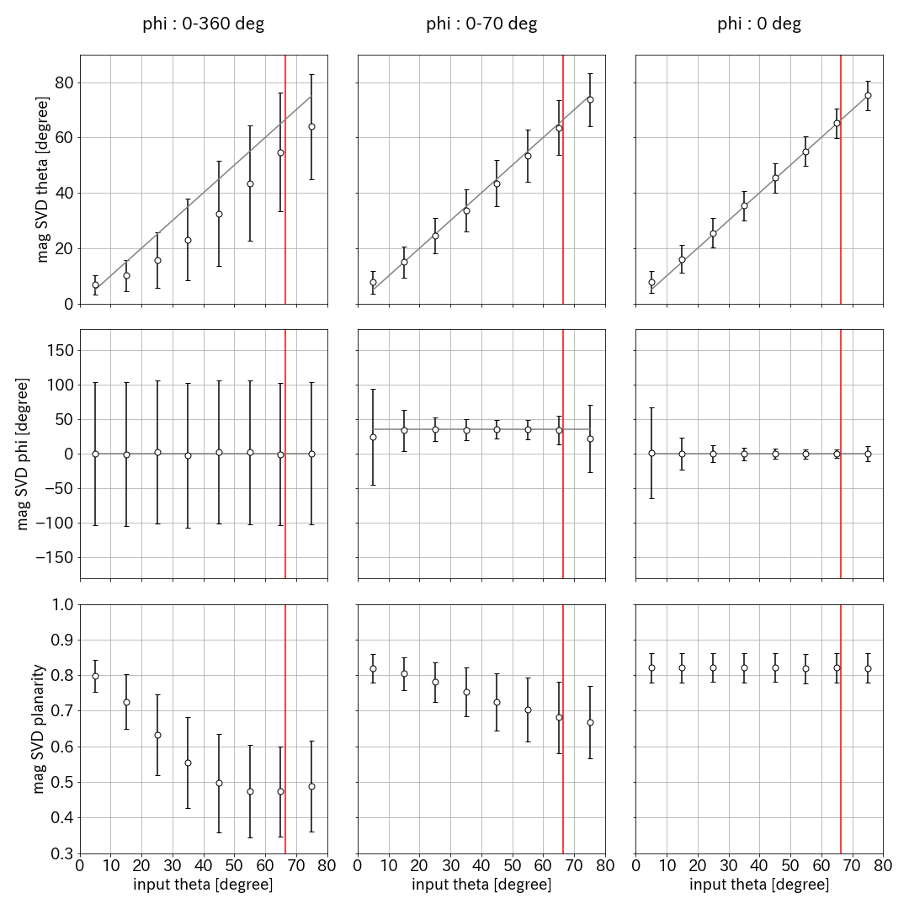
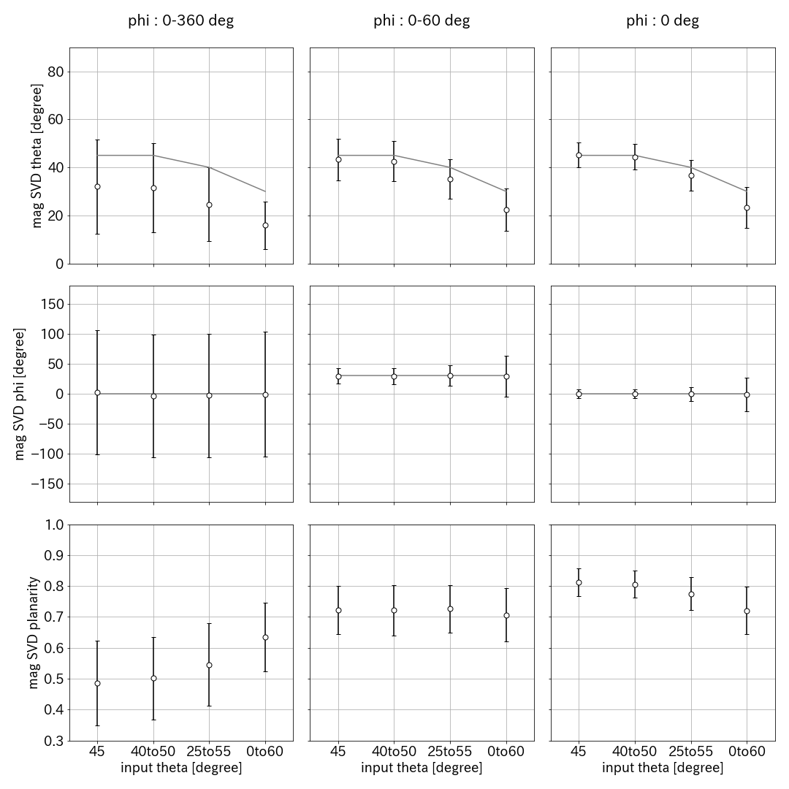
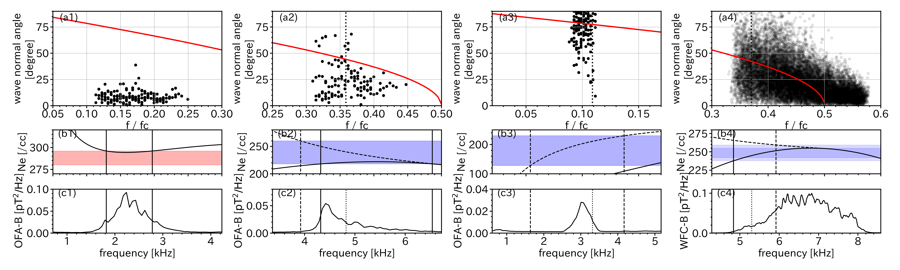
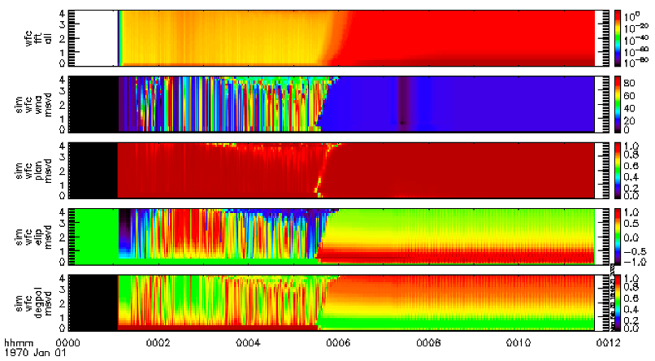

# 模擬波形計算

### 使用するコード
- erg_duct_calculation_IDL/SVDKuritasanTool/ampuku  
calc_planarity_fwhm_to_csv.pro 39-41行目 パス名を適宜変更  

- python/for_planarity_fwhm/  
for_M_thesis_5_2.pyなど.. dircと保存先を適宜変更  

### コード使用例
tplotを使用できるよう  
```
IDL> erg_init
```
を実行。  
模擬波形作成後SVD解析してくれるコード(IDL, 京都大学栗田さんよりいただきました🙇‍♀️)を複数回まわし、値をcsvファイルに記録する。  
ここで、位相のランダム性や周波数の範囲を変更したい場合、コメントアウトにしたがって ampuku/makewave_ofa.pro の内容を書き換えてからコードを回す。  
12行目 変数 testn で試行回数を変更可能。修論では`testn=2000`とした結果をplotした。実行に時間がかかるので、最初は試行回数を100回など少なめで試すと良いかも。
```
ERG> calc_planarity_fwhm_to_csv
```
calc_planarity_fwhm_to_csv内では、function make_csvを実行しており、作成したい模擬波形の種類に合わせてmake_csv内の値を指定することで足し合わせる波の条件を変更できる。  
python/for_planarity_fwhm/for_M_thesis_5_2.pyを実行、出力データをpythonで統計処理し、plotする。  

### 出力画像例
- 修論図5-2(方位角方向に広がりをもった模擬波形に対する SVD 解析結果,for_M_thesis_5_2.py)
  
- 修論図5-4(plot_SVD_with_fwhm_rand_fconst_defWNA(2)_2.py)
  
- 修論図C-1,C-2も設定を変えれば作成可能  
  


# WNAと周波数曲線の解析

### 使用するコード
- IDL/for_paper_figure/f_ne_f_b_plot.pro,f_wna_plot.pro   
136行目、240行目のFile_pathを適宜書き換え。CSVファイルの保存場所になる
- python/for_paper_figure/f_ne_f_b_f_wna_plot.py  
pathを適宜書き換え  

### コード使用例
WFCデータ(Event4)の磁場のスペクトルマトリクスを計算したい..  
ISEE_WAVEに計算してもらうために次のコードを実行。
```
IDL> ISEE_WAVE
```
出てきたGUIにユーザーIDとパスワードを入力、Loginする。  
時間をEvent4の時間帯(start=2017-07-03/04:32:00, end=2017-07-03/04:32:55)に設定してStart Calcurationを押す。  
tplot変数'bspec'が作成される。(ここ、ほんとは自分でWFCデータ用の磁場のスペクトルマトリクス計算コードを書くのが望ましい..)  
さらにWFCデータ(Event4)のWNAを保存しておきたい..  
GUIのOutputタブを選択、tplot Save File (.tplot)をクリック。
WFCデータイベントでない場合(Event1-3)はここまでの手順は必要なく、次のコードをそのまま実行して良い。
```
IDL> erg_init  
ERG> f_ne_f_b_plot
```
あらせのデータを解析した結果がcsvファイルに保存される。 
伝搬角解析結果を保存したい。
```
ERG> f_wna_plot
```
保存された。  
pythonでf_ne_f_b_f_wna_plot.pyを実行しplotを作成する。  

### 出力画像例
- 修論図4-4(解析結果)、論文の結果の図  
  
  


# イベントプロットの作成

### 使用するコード
IDL/for_paper_figure/event_plot.pro

### コード使用例
```
IDL> erg_init  
ERG> event_plot
```

### 出力画像例
- 修論図4-1,4-2,4-3(イベントの概観) 
  

# 加藤先生シミュレーション結果の図示

### 使用するコード
- IDL/for_katohsensei_simuration  
read_wfc_sim_v00.pro 12行目 dirに加藤先生シミュレーション結果を置いているディレクトリを指定。  

### コード使用例
京都大学 栗田さんにいただいたコードを実行。  
```
IDL> erg_init
ERG> read_wfc_sim_v00
```
適宜各軸を合わせる。  
ここで、時間軸と周波数軸がなんだか怪しいが、これは栗田加藤土屋(安福)がざっと考えたが不明のまま。丁寧に考えれば分かりそうだけど..という空気のままクローズしている。  
`read_wfc_sim_v00,dir='N035_H0026/'`のように見たいデータを指定することで他のデータをplotできる。  

### 出力例
- 引き継ぎ資料P5 右図(GUIをスクショして作成)  
  

